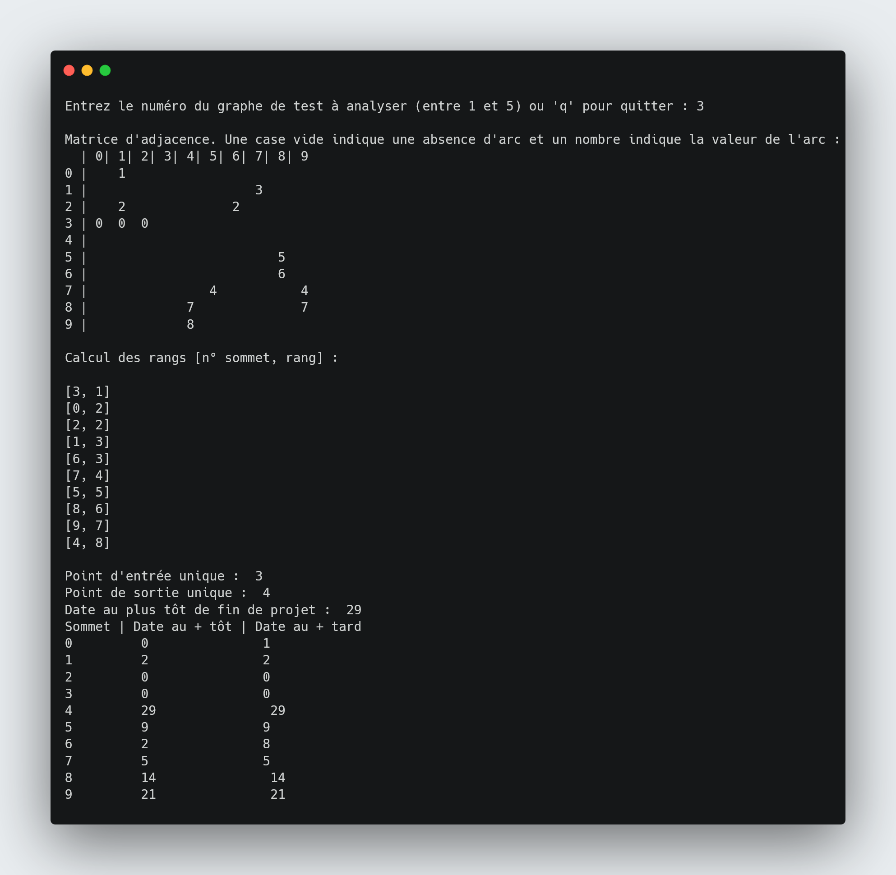

# Python graphes

## Vue d'ensemble

Programme en Python réalisé dans le cadre du cours de Théorie des Graphes en L3 au cycle Ingénieur d'Efrei en apprentissage.



Projet réalisé par les étudiants du groupe LS1 (Parcours Logiciels et Systèmes d'information) :

Laurie BRAL \
Mélanie Dang \
CHEN Xing \
Antoine DESPRÉS

## Usage

1. Exécuter le fichier `src/main.py` soit avec un IDE (Pycharm par exemple) soit dans le terminal avec la commande suivante :

```bash
// Se placer dans src/
cd src
python3 main.py
```

2. Saisir un numéro de la grammaire de 1 à 5.

```
Entrez le numéro du graphe de test à analyser (entre 1 et 5) ou 'q' pour quitter :
```

3. Enjoy !

## Fonctionnalités

Il doit mettre en oeuvre les fonctions suivantes :

1. Lecture d’un graphe orienté et valué décrit dans un fichier “.txt” et représentation en mémoire
   Sommets numérotés de ‘0’ à ‘n-1’ pour un graphe de ‘n’ sommets.
   Valeurs numériques quelconques.
   Au plus un arc d’un sommet donné ‘x’ vers un sommet donné ‘y’.
   Aucune autre restriction ne doit être imposée par votre programme.

2. Affichage du graphe sous forme d’une “matrice d’adjacence + valeurs”
   Matrice au même dimensions qu’une matrice d’adjacence.
   M[x,y] =
   valeur de l’arc s’il existe
   rien, ou symbole spécial, si l’arc n’existe pas

3. Calcul des rangs par l’algorithme de votre choix. En cas de présence de circuit, le
   calcul est interrompu.
   Donc votre algorithme de calcul de rang inclut la détection de circuit !

4. Vérification de l’existence d’un point d'entrée unique et d’un point de sortie unique

5. Si possible (rangs calculés, point d’entrée unique, point de sortie unique), calcul des
   dates au plus tôt et dates au plus tard

## Structure de fichiers

Les traces d'exécution se trouve dans `docs/`.
